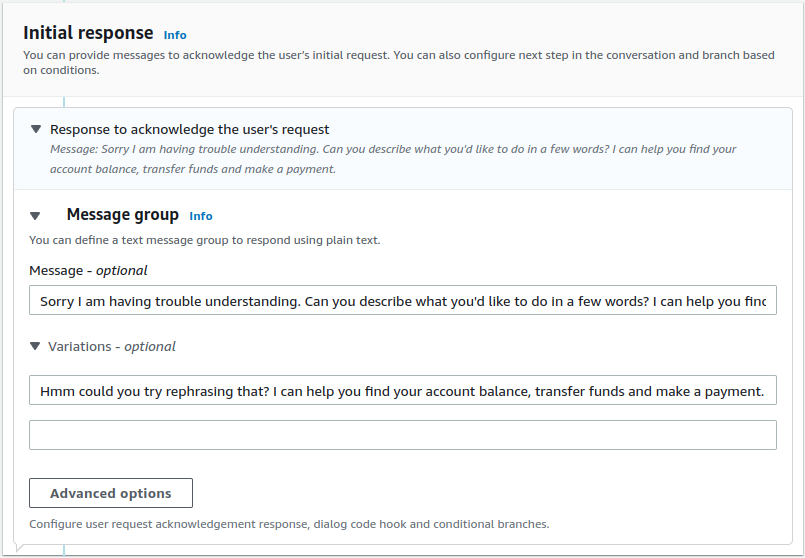
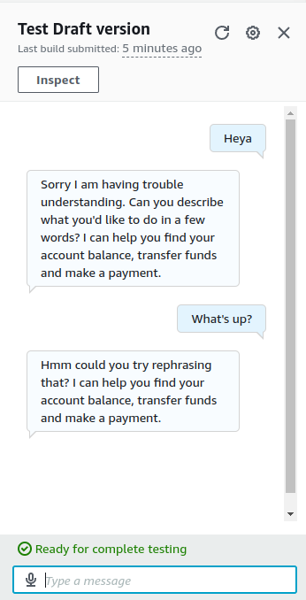

# Chatbot with Amazon Lex

[Demo](https://github.com/arwinder-jaspal/chatbot-with-amazon-lex?tab=readme-ov-file#demo)

## Description

This is a simple chatbot with Amazon Lex. I will guide you on how to create a chatbot using Amazon Lex.

## Setup

### Step 1 - Create a bot

1. Log in to [Amazon Lex](https://console.aws.amazon.com/lex/home) 
2. Create a bot in Amazon Lex.

3. Create a blank bot using Amazon Lex.

- For bot name, enter "BankerBot".
- For Description, enter "Banker Bot to help customer check their balance and make transfer".

- Under IAM Permissions, select **Create a role with basic Amazon Lex permissions**.

> **Why do we need Amazon Lex permissions?**
>
> Amazon Lex needs the permission to call other AWS services on your behalf, later in this project series you'll be integrating Lex with another service called Lambda!

- Under **Children’s Online Privacy Protection Act (COPPA)**, select **No**.
- Under **Idle session timeout**, keep the default of **5 minutes**.

- Click **Next**.

#### Set up Bot Voice
- Keep the language as **English** so you can explore Lex's full set of features in this project.
- Under **Voice interaction**, click on the dropdown that says **Danielle**.
    - Click around different voice options to choose your favorite one!
- For **Intent classification confidence score threshold**, keep the default value of **0.40**.


> **What is intention classification confidence score threshold?**
>
>When you're using Amazon Lex to build a chatbot, this threshold is like a minimum score for your chatbot to confidently understand what the user is trying to say.
>
>Setting this to 0.4 means that your chatbot needs to be at least 40% confident that it understands what the user is asking to be able to give a response.
>
>So if a user's input is ambiguous and your chatbot's confidence score is below 0.4, it'll throw an error message.

- Click **Done**.

### Step 2 - Add Intents

After bot is created, you will automatically see a page called **Intent: NewIntent**

> **What is an Intent?**
>
> An intent is what the user is trying to achieve in their conversation with the chatbot. For example, checking a bank account balance; booking a flight; ordering food.
>
>In Amazon Lex, you build your chatbot by defining and categorising different intents. If you set up different intents, one single chatbot can manage a bunch of requests that are usually related to each other.

#### Creating an Intent

- Under **Intent details**, enter `WelcomeIntent` for the **Intent name**.
- Add the description `Welcoming a user when they say hello`.

- Scroll down to the **Sample utterances** panel.
- Click the **Plain Text** button.
- Add the following utterance: 
```
Hi
Hello
I need help 
Can you help me?
```
-  Click back to the **Preview** button to see these utterances in chat form.

- Scroll down to **Closing response**, and expand the arrow for **Response sent to the user after the intent is fulfilled**.
- In the **Message** field, enter the following message:`Hi! I'm BB, the Banking Bot. How can I help you today?`


- Choose **Save intent**.
- Choose **Build**, which is close to the top of the screen.
    - This takes about 30 seconds to build.
- Choose **Test**.
- The following dialog will pop up, and you can interact with the bot by entering your opening message.

- Here if we try to use phrase that are not in the list of utterances, the bot will return an error message.


> **How does my chatbot respond to these user inputs?**
> 
> The first three are successfully recognized - Amazon Lex is able to use its ML techniques to match what you have said against your utterances.
>
> But the last two fail, resulting in an **Intent FallbackIntent is fulfilled** response - meaning Amazon Lex doesn't quite recognize your utterance. We'll learn what FallbackIntent means in the next step.

### Step 3 - Managing Fallback

In this section, we will create a new intent called FallbackIntent.

> **What is FallbackIntent?**
>
> When you have a conversation with a bot, the bot can't quite understand what you're trying to say. This is where **FallbackIntent** comes in.
>
> When Amazon Lex can't find a match for the utterance, it will use the FallbackIntent to respond to the user.

#### Creating *FallbackIntent*

- In your left hand navigation panel, choose **FallbackIntent**.

- Scroll down to **Closing responses**.
- Expand the arrow for **Response sent to the user after the intent is fulfilled**.
- In the **Message** field, add the following text:‍
`
Sorry I am having trouble understanding. Can you describe what you'd like to do in a few words? I can help you find your account balance, transfer funds and make a payment.
`
- Scroll down to **Variations - optional**.
- Expand the arrow.
- Enter the following text:
```
Hmm could you try rephrasing that? I can help you find your account balance, transfer funds and make a payment.
```


- Choose **Save intent**.
- Choose **Build**.
- Choose **Test**.



> **How does my chatbot respond to these user inputs?**

# Demo
[demo.webm](https://github.com/user-attachments/assets/e317c3a0-41cb-4422-b24e-d8fbf1186c7e)
